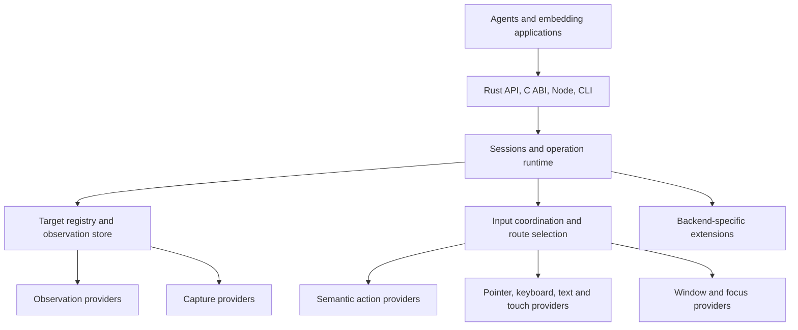

# Unimation architecture

Implementation status, 2026-09-16: the Cargo workspace implements direct Rust macOS AX, Quartz and SkyLight providers, ScreenCaptureKit still capture with explicit executable alternative, typed session routing, retained snapshot queries/diffs, compact text and JSON presentation adapters, viewport hints, live actionability evidence, and frame coordinate validation. An optional Rust AppKit cursor overlay is a separate visual process. Linux has AT-SPI2 observation and actions, Wayland and X11 input routes, compositor capture, Hyprland window discovery and a layer-shell cursor renderer; see [the Linux guide](docs/linux.md). See [README](README.md), [backend tasks](docs/backends.md), [presentation and viewport behavior](docs/presentation.md), [SkyLight details](docs/skylight.md), and [validation](docs/validation.md) for implemented behavior and tested limits. The sections below remain the broader target architecture.

Status: working design. Command names and Rust contracts below describe the target architecture unless identified as implemented in the linked implementation documentation. Research evidence alone does not establish runtime support.

Reading guide: [target and reference model](#3-target-model-trees-plus-relationships), [windows and transient UI](#6-windows-popups-and-modal-interaction), [execution behavior](#9-operation-contract), [Rust composition](#14-rust-composition-and-provider-lifecycle), [conformance](#18-conformance-and-compatibility-testing), and [research evidence](#20-research-evidence).

## 1. Purpose and scope

Unimation gives agents a consistent interface for operating applications, browsers, mobile devices, and operating-system UI. The core is a Rust library with independently composable providers and an execution runtime. Commands follow the useful behavior of agent-browser: compact snapshots, references, locators, clicks, text entry, scrolling, waits, and diffs.

The primary consumer is an agent. Accessibility supplies semantics and some action routes, while pointer, keyboard, touch, and platform-specific delivery provide the wider interaction model. An agent must be able to operate a canvas, an embedded editor, a native file panel, and shell UI as part of the same workflow.

### Agreed decisions

- Use Rust for the core and provider contracts.
- Separate observation, capture, target resolution, semantic operations, input delivery, window control, and verification.
- Allow several providers for one capability and different providers for different steps where compatible.
- Preserve controllable background and foreground behavior. Public APIs, private symbols, undocumented protocols, and target-side native bridges are first-class provider choices, including SkyLight. Select them by the requested behavior and measured compatibility.
- Keep the ordinary command vocabulary consistent across targets. Expose specialized features through discoverable extensions.
- Exclude arbitrary JavaScript evaluation, page-script injection, and injected helpers from the initial browser implementation. An upstream implementation that relies on them cannot be adopted unchanged.
- Support embedded Rust use, a C-compatible ABI, Node bindings, a CLI, and an optional local service and agent-protocol adapter.
- Accept deployment-specific mobile backends, including ADB. Simulator, developer-connected device, installed service, and embedded SDK are distinct support modes.
- Reuse established accessibility semantics where suitable. AccessKit remains a candidate for the semantic payload, not a ready-made external application reader.

### Meaning of universal

Universal describes the command model and extensibility. Support is measured for an operation, target kind, delivery route, OS version, session type, and deployment configuration. Unknown support and unavailable routes remain explicit. A platform label alone is insufficient.

The runtime should attempt supported alternatives without requiring agents to know framework internals. It must not claim that every application supports every operation in the background.

## 2. Architecture and ownership



| Component | Owns | Must not assume |
|---|---|---|
| Discovery | Processes, windows, documents, displays, transient and shell targets | One PID has one window |
| Observation | Native tree reads, properties, relationships, event subscriptions | Reading the tree is complete or atomic |
| Capture | Image buffers, crops, timestamps, transforms, capture provenance | A window capture contains its separate popup windows |
| Target registry | Public references, native identity bindings, target lifecycle | Titles, indexes, PIDs, or native handles are permanent identities |
| Resolution | Resolve a reference or locator into exact native targets and regions | Element selection determines delivery method |
| Operation layer | Meaning of fill, click, check, scroll, drag, and sequences | A successful provider call proves the desired result |
| Delivery providers | Native input and semantic mechanisms | Other providers share their coordinate or focus conventions |
| Coordinator | Resource leases, ordered execution, cancellation, route continuity | Different windows always have independent input |
| Verification | Dispatch evidence, observed effects, postconditions | No observed change proves no side effect |
| Presentation | Compact trees, diffs, annotations, continuation | A compact display is the authoritative stored state |

A provider may implement several traits. A composed backend delegates traits to different providers. Provider boundaries describe responsibilities, not a requirement to create a separate process for each trait.

Keep planning a user's task outside this runtime. The runtime plans the mechanics of a requested interaction and reports enough evidence for the agent to choose its next action.

## 3. Target model: trees plus relationships

A surface is an independently addressable UI region, such as a window, sheet, menu, browser document, panel, or remote desktop viewport. It need not have its own native window handle.

Use a forest of observed trees and a separate relationship graph. Preserve native containment while recording ownership, embedding, blocking, and presentation relationships that do not fit containment.

### Identity domains

| Identity | Scope and lifecycle |
|---|---|
| Device | One local or remote device connection and its incarnation |
| Desktop session | The interactive login/session and desktop or compositor context |
| Process instance | PID plus process-start evidence or an observed incarnation |
| Window | Native window identity plus process/session incarnation |
| Surface | A window, transient region, shell panel, or embedded document instance |
| Document/frame | Document generation, frame identity, and protocol session |
| Element | A logical identity tracked within its source and owning surface |
| Observation | Immutable record of what was actually read |
| Capture | Immutable image and geometry record |

Public identities are opaque. Human-facing aliases such as `@w4`, `@s8`, and `@e12` resolve within a session namespace. A backend-provided number is never a globally unique public identity.

### Relationships

Represent `contains`, `owned_by`, `transient_for`, `opened_by`, `embedded_in`, `blocks`, `labelled_by`, and `controls` separately. An `opened_by` edge is observed or inferred provenance, not proof that the new surface is safe to use or belongs to the same process.

Record evidence for relationships: native owner handle, accessibility relation, protocol attachment, event correlation, or heuristic. A heuristic association must not silently authorize exact-target action routing.

The graph supports cross-process relationships and missing endpoints. Do not recursively traverse arbitrary relationship edges as if they were tree children; deduplicate nodes and detect cycles.

AT-SPI explicitly provides popup and cross-process embedding relationships. This supports retaining those edges instead of flattening them away. [AT-SPI relations](https://gnome.pages.gitlab.gnome.org/at-spi2-core/libatspi/enum.RelationType.html)

### Independent state dimensions

Track existence, visibility, minimized state, occlusion, enablement, modality, keyboard focus, pointer capture, z-order, virtual desktop membership, and semantic actionability independently. Every field can be unknown or unsupported.

A covered window may accept semantic actions. A visible control may be blocked by a modal sheet. A popup may own keyboard input without replacing the parent's focused-window identity. Neither visibility nor a successful tree query proves actionability.

## 4. Stable references, observations, and locators

### Three distinct concepts

1. An exact reference identifies the same tracked element instance across observations while continuity is established.
2. An observation identifies the properties, location, and context the agent saw at a particular time.
3. A locator is a reusable query that may intentionally resolve to a newly created matching element.

`click @e12` must not silently become "click whichever Save button now occupies the old position." A caller that wants replacement-tolerant behavior uses a locator, scoped to the intended window or document.

A native ID can remain unchanged while its properties change. It can also be recycled, or a virtualized control can represent a different data item. Windows runtime IDs are explicitly reusable over time. [UIA runtime ID contract](https://learn.microsoft.com/en-us/dotnet/api/system.windows.automation.automationelement.getruntimeid)

### Proposed reference record

```text
ElementRef
    session_namespace
    public_identity
    owning_surface_incarnation
    provider_instance_and_epoch
    native_identity_evidence
    continuity_kind
    last_observed_revision
    status
```

Statuses include live, outside current observation coverage, detached, replaced, ambiguous, and expired. An unavailable native handle does not automatically prove deletion. Conversely, a live handle alone does not prove the same logical row or control survived.

Do not reuse a public alias for another identity within the same session. If a session restarts, its namespace changes. Persisted locators may be restored; persisted native handles are not assumed valid.

### Reconciliation rules

- Prefer native identity comparison within a validated process, document, provider, and surface incarnation.
- Treat provider stable keys as evidence with declared scope, not unrestricted guarantees.
- Property and geometry changes can update an existing reference without changing its identity.
- Structural similarity, role, label, bounds, and sibling ordinal can suggest candidate matches. They are insufficient alone to prove exact identity.
- A proven replacement receives a new exact reference. A separate `possible_successor` relation can explain the match to the agent.
- Duplicate controls and reordered lists require disambiguation. Never rely on the first match for an exact reference.
- If a tree is truncated or a subtree was not fetched, its missing nodes are outside coverage, not deleted.
- Switching observation providers invalidates their native bindings. Preserve public identity across that switch only with a validated cross-provider mapping.
- Same-document changes may preserve identity; document replacement, renderer reconnection, or process restart requires a new generation unless continuity is independently established.

A display-friendly diff may use weaker matching than an action resolver. If it does, label the inferred relationship and do not grant an actionable identity based on it.

### Example

```text
Observation o41
    @e12 textbox "Subject" value="Draft"
    @e13 button "Send"

fill @e12 "Updated"

Observation o42
    ~ @e12 value="Updated"
    @e13 remains the same verified element
```

If the framework destroys and recreates the textbox, `@e12` becomes replaced and a new reference is returned. A locator for the Subject textbox can resolve the replacement. Stable references mean continuity where demonstrated, not permanence despite destruction.

### Freshness and concurrent changes

An unchanged reference does not imply that acting from an old observation is valid. Require the relevant target state to be revalidated before dispatch. Track both runtime mutation epochs and observed external-change revisions.

Runtime epochs detect competing Unimation writes. They cannot detect every human, application, or compositor change. Revalidate identity, geometry, focus, blocking, and operation-specific preconditions at the final dispatch boundary. A small check-to-use race remains on APIs without atomic validation and dispatch; report this limitation rather than implying transactions isolate the desktop.

### Locator contract

Support role, name, label relationships, native identifier, ancestor scope, selected state, and table coordinates or keys. Exact matching is the default for consequential target resolution. Fuzzy search can return candidates for the agent to choose.

Locators re-query live state for actions; snapshot queries operate on the immutable stored observation. Distinguish these modes in results. Strict locators reject multiple matches. An explicit `nth` selects by the current ordering and must not be described as stable identity.

## 5. Tables, lists, and virtualized content

Preserve table, tree-grid, row, cell, header, selection, expanded state, row/column count, spans, and logical indexes where exposed. Distinguish rendered position from logical index and any application-provided record key.

A row's fourth visible position may refer to a different record after sorting or scrolling. Row content signatures can detect contradictions but do not guarantee uniqueness. Duplicated records require a stronger key or explicit caller disambiguation.

Keep these operations distinct:

- Read a cached visible row.
- Find a logical item by an exposed property.
- Materialize a virtualized item.
- Scroll an item into view.
- Select, edit, or activate the item.

Materialization and scrolling can change UI state and focus. They require declared effects; ordinary cached search must not trigger them invisibly. UIA exposes ItemContainer and VirtualizedItem patterns, and realizing an item does not guarantee it becomes visible. [UIA virtualization](https://learn.microsoft.com/en-us/windows/win32/winauto/uiauto-workingwithvirtualizeditems)

Bound list exploration by rows, time, scroll attempts, and observed progress. Detect repeated viewport content and end-of-list separately from delivery failure. Do not promise a complete export of an infinite or partially accessible table.

Text ranges and selected cells are revision-scoped. Editing or resorting can invalidate ranges even when their containing control survives.

## 6. Windows, popups, and modal interaction

### Window selection and focus

`window use @w4` binds a session target without activating it. `window activate @w4` requests activation. Switching a target must not silently change focus, close another window, or adopt whichever window is now frontmost.

When a bound window closes, return `target_closed`. Do not redirect to a neighboring window with the same title. Discovery may offer candidates. Multiple windows under one PID require an exact window target or an explicit selection rule.

Track native owner, main/key window, focused element, and z-order separately. A title change does not create a new window identity. A recycled native handle does.

### Transient surface kinds

| Kind | Required treatment |
|---|---|
| Window-modal sheet | Blocks its owning window; may leave sibling windows usable |
| Application-modal dialog | Blocks the relevant application scope |
| Native file panel | May belong to another service process; resolve its actual owner |
| Context menu or submenu | May be a separate native window; track opener and menu chain |
| Popover or flyout | Determine actual blocking and input behavior; do not assume modality |
| Tooltip or notification balloon | May only convey information; may also contain actions |
| Combo-box popup or autocomplete | Often separate from the edit control; preserve selected item and keyboard ownership |
| IME candidate panel | Belongs to text composition; global Enter or Escape can affect composition |
| Browser alert or permission panel | Distinguish browser chrome, document modal UI, and native OS dialog |
| Picture-in-picture or floating palette | Can remain independent and non-modal |
| Agent overlay | Exclude from discovery and hit-testing unless explicitly requested |

The visual shape of a balloon, panel, or overlay does not establish whether it blocks input. Use native modal properties, ownership, enablement, hit-testing, and observed input state. Where evidence is incomplete, report unknown blocking rather than acting beneath a suspected modal surface.

Apple distinguishes a window from a sheet in the AX window relationship. UIA separately exposes window modality. [AX window attribute](https://developer.apple.com/documentation/applicationservices/kaxwindowattribute), [UIA window pattern](https://learn.microsoft.com/en-us/windows/win32/api/uiautomationclient/nn-uiautomationclient-iuiautomationwindowpattern)

### Blocking graph

Before dispatch, determine whether an active surface blocks the target for the selected operation. Return the blocking surface reference, its owner, and an updated scoped observation when available.

Do not let a semantic backend bypass a known modal interaction boundary merely because an underlying control still exposes an invoke method. A typed operation with intentionally broader scope must be explicit.

Modal boundaries are scoped. A sheet on one window must not freeze unrelated applications or independent windows without evidence. Avoid one global modal stack that assumes all modal UI is nested in a single chain.

When a step opens a dialog, stop dependent steps whose target or focus assumptions are invalidated. Return newly opened surfaces even if the originating call timed out. Closing a dialog does not establish where keyboard focus returned; revalidate it.

### Menus

Provide a semantic menu-path operation as well as ordinary pointer and keyboard commands. Resolve each path segment against live state after opening its parent. Menus can populate lazily and their nodes can be replaced while opening.

Preserve duplicate item names, separators, enabled state, checked state, submenu ownership, accelerator text, and split-button regions. An accelerator label is not automatically a portable key sequence.

Menu traversal must distinguish observation from opening a submenu. Opening or initializing a menu can execute application code. Pywinauto's classic menu implementation illustrates explicit menu initialization; Cua's macOS traversal re-resolves the menu root for each hop. [Menu sources][src-pywinauto-menu], [macOS traversal][src-cua-menu]

Hover paths may need dwell time and movement through a submenu corridor. An outside click can dismiss a menu and activate an underlying control. Do not use outside-click dismissal as a universal recovery action.

## 7. Operating-system UI

Shell UI is a first-class target family. Discovery must work even when there is no ordinary application window.

| Platform | Required investigation and fixtures |
|---|---|
| macOS | App menu bar, status items, Dock, Spotlight, Control Center, Notification Center, Mission Control, native Open/Save panels, Spaces, full-screen transitions |
| Windows | Start, Search, taskbar, notification-area icons and overflow, quick settings, notifications, system menus, native file dialogs, virtual desktops |
| Linux | GNOME Shell and KDE Plasma panels, launchers, overview, tray implementations, compositor-managed popups, portal dialogs, window-manager menus |
| Android | Launcher, recent apps, notifications, quick settings, permission dialogs, IME, split screen, picture-in-picture |
| iOS modes | Simulator and developer-connected system UI where exposed; embedded SDK scope remains the host application |

These are coverage targets, not claims of support. Shell implementations vary by OS release, desktop environment, and configuration. Do not key the public API to process names such as Explorer or Dock. Platform adapters may use those details with versioned detection and verification.

Global menu bars can have application ownership while displaying state for a particular active window. Scope menu queries explicitly. Never return a healthy-looking menu-bar tree as a substitute for an unresolved requested window.

Search results, notifications, and tray popups are transient. Their appearance order and titles are poor identities. Auto-hiding panels and full-screen/virtual-desktop transitions can invalidate geometry. Expose the transition rather than silently switching desktops during observation.

Secure desktops, locked sessions, and protected prompts can be unavailable even when ordinary accessibility permissions are granted. Return the actual session or access boundary. No automatic elevation or assumption that an agent can approve every OS prompt.

## 8. Browser and embedded content

An ordinary browser window and its attached document are linked targets. Native menus, tab strips, downloads UI, permission bubbles, and file panels remain discoverable through the appropriate native route.

Browser-protocol support may use document/accessibility inspection and input APIs without exposing script execution. Audit every reused operation for hidden `Runtime.evaluate`, `callFunctionOn`, injected listeners, selectors implemented through script, and script-based hit-testing. Mark unsupported features or implement a non-script route; do not silently add injection for parity.

A browser connection does not imply every embedded WebView exposes a debugging endpoint. Discover connections and maintain an OS-accessibility route for inaccessible endpoints. React Native, Electron, WebView2, WKWebView, Qt, Flutter, and custom-rendered applications are compatibility test families, not necessarily separate top-level provider traits.

### Frame identity and geometry

Namespace protocol node IDs by connection/session and document generation. Track out-of-process iframe attachment, frame navigation, renderer replacement, tab closure, and reconnection independently. Do not share caches keyed only by a numeric node ID.

Frame-local rectangles and paint order must remain scoped to their document. Sibling frame rectangles cannot occlude one another before conversion into a common coordinate space. Browser-use includes regression tests for both session ID collisions and iframe-local occlusion. [Frame regression tests][src-browser-identity]

Nested transforms, scrolling, clipping, browser zoom, and device pixel ratio affect click mapping. Closed shadow roots or omitted accessibility subtrees remain partial observations. Do not claim a complete DOM-equivalent tree from accessibility alone.

### Protocol implementations and browser isolation

Maintain a method-level implementation manifest. A Chromium route can use `DOM.getDocument`, `querySelector`, `getContentQuads`, `getNodeForLocation`, `scrollIntoViewIfNeeded`, and `focus`, alongside Accessibility, DOMSnapshot, Page, and Input methods. Discovery of a method does not prove every target supports it. Keep file-input assignment in an extension with explicit local versus remote path handling. `Input.insertText`, `imeSetComposition`, and `dispatchKeyEvent` represent different text behavior. Protocol drag data and native OS drag-and-drop also need separate capabilities. [CDP DOM](https://chromedevtools.github.io/devtools-protocol/tot/DOM/), [CDP Input](https://chromedevtools.github.io/devtools-protocol/tot/Input/)

WebDriver BiDi is another protocol provider candidate. Its working draft defines node location, screenshots, context lifecycle, input sequences, and input release. Negotiate implemented commands per browser release. A specification entry alone does not establish availability. [BiDi draft](https://www.w3.org/TR/2026/WD-webdriver-bidi-20260914/)

Stagehand's inspected locator uses an isolated execution world and `Runtime.callFunctionOn`. Its prepared-action design is useful, but that locator cannot enter the initial browser backend unchanged. Test the transport itself for prohibited evaluation, preload scripts, and injected helpers, including calls made by dependencies. [Stagehand locator](https://github.com/browserbase/stagehand/blob/f1c26a68d97004ef3091bbd6828d20cad2589fc3/packages/extension/understudy/locator.ts)

Aside describes CDP wrappers, browser changes for background agent tabs, a viewport independent of the user's window, and asynchronous popup/download/tab-close signals. This is a first-party engineering account of closed-source software, not an inspected implementation. Treat owned or patched browser isolation as a specialized provider profile. An attached stock browser must advertise its actual focus and viewport behavior. Keep event notifications compact and correlated with targets. [Aside engineering account](https://aside.com/blog/how-we-built-the-sota-browser-agent-that-outperforms-fable)

### Connection ownership

Distinguish attaching to an existing browser, launching an owned browser, profile-state copying, persistent automation profiles, and extension-mediated access. Closing Unimation must not terminate externally owned browsers or unrelated tabs. A target that disappears stays closed until the caller deliberately binds another target.

Cross-provider duplicate nodes may be linked when identity is established. Otherwise retain source-qualified views and let the resolver choose one. Avoid guessing that overlapping AX and protocol nodes are identical.

## 9. Operation contract

Commands should have consistent meaning across providers. The following vocabulary is proposed, not a claim of exact compatibility with another CLI.

| Family | Commands and meaning |
|---|---|
| Observe | `snapshot`, `inspect`, `get`, `find`, `screenshot`, `diff` |
| Pointer | `click`, `dblclick`, `rightclick`, `hover`, `move`, `down`, `up`, `drag` |
| Semantic | `activate`, `check`, `uncheck`, `select`, `expand`, `collapse`, `setvalue` |
| Text | `fill`, `type`, `inserttext`, `clear`, `selecttext` |
| Keyboard | `press`, `keydown`, `keyup` |
| Scrolling | `scroll`, `wheel`, `scrollintoview` |
| Targets | Discover, bind, activate, resize, move, close, and inspect windows/surfaces |
| Coordination | `wait`, bounded sequences, cancellation, outcome lookup |
| Diagnostics | Trace, recording, provider status, route explanation |
| Extensions | Versioned backend-specific commands with declared requirements and effects |

### Behavioral distinctions

- `click` promises pointer interaction. Semantic activation is a separate operation; equivalent substitution requires an explicit contract and appears in the result.
- `activate` requests an element's primary action. Window activation uses the window command namespace to avoid ambiguity.
- `fill` replaces editable content. Route selection must preserve the declared event behavior and verify the resulting content when observable.
- `type` enters text at the current caret or selection; it does not promise keyboard-layout-specific physical key events.
- `inserttext` requests text insertion without promising individual key-down/up events. `keyboard type` requests key-event behavior and may reject text that the selected route cannot represent.
- `setvalue` uses a value-setting capability and does not claim equivalence to typing or clicking.
- `check` and `uncheck` ensure a desired state. A tri-state control requires an explicit treatment of its indeterminate state.
- `select` specifies selection replacement versus additive selection and distinguishes item identity, label, value, and index.
- `scroll` targets content movement; `wheel` describes wheel input. Units and sign conventions are explicit.

Event fidelity is part of the operation request: semantic, pointer, key events, or text insertion. `auto` chooses among compatible routes; it does not permit changing the requested behavior.

### Actionability and reusable preparation

Return an `ActionabilityReport` with separate existence, visibility, geometry stability, reachable hit point, enabled, editable, focus, and blocking checks. Each check carries evidence, timestamp, and unknown status. The required checks depend on the operation and route. A semantic action can be valid offscreen; pointer input needs a reachable point. Bypassing a check does not prove delivery. Wait for bounded target-local stability rather than global network or animation silence. [Playwright actionability](https://playwright.dev/docs/actionability)

A prepared operation stores command semantics version, arguments, exact reference or scoped locator, target incarnation, observation provenance, preconditions, constraints, provider fingerprint, and expiry. Preparation is read-only unless its declared request includes materialization or other effects. Execution revalidates identity, geometry, blockers, route availability, and relevant state.

Keep presentation diffs, native property caches, locator plans, and prepared operations in separate caches. Their invalidation rules differ. Include locale when labels participate in a locator. A reusable plan saves resolution work; its previous result is never evidence of a new action's success.

Stagehand's inspected cache client replays cached actions and can fall back after replay failure; its server-side cache-key implementation was not inspected. Unimation must record the completed sequence prefix and any uncertain step before fallback. Replaying a whole form submission after only its final observation failed can duplicate the submission. [Stagehand cache client](https://github.com/browserbase/stagehand/blob/f1c26a68d97004ef3091bbd6828d20cad2589fc3/packages/extension/services/cacheService.ts)

## 10. Delivery, focus, and execution state

### Delivery constraints

Represent independent limits for application activation, raising windows, keyboard-focus changes, virtual-desktop changes, physical pointer movement, global input, and clipboard use. Offer simple presets while retaining detailed library controls.

Suggested presets are strict background, temporary foreground with conditional restoration, and explicit foreground. Invalid preset values fail validation. A best-effort route cannot claim strict background guarantees.

Restoring focus after an action is different from never changing focus. A focus guard must not restore an old window over a newer user choice. Record the focus state established by Unimation and restore only if it still owns that state; otherwise report interruption or skipped restoration.

A semantic operation can itself activate an app or open another window. Providers declare expected effects, and verification records observed effects. Pre-dispatch policy cannot guarantee an arbitrary application never changes focus.

### Native focus and event routing

On macOS, track AX focus, native key window, main window, first responder, front process, and z-order separately when the provider can observe them. Unknown native state stays unknown. A route described as "without raise" may still change the key window and front process, as yabai's implementation does. Do not promise strict background delivery from that name. [Yabai focus implementation](https://github.com/asmvik/yabai/blob/dd845723416f5fe92af49fad5ebab00369e07edd/src/window_manager.c)

Cua's activation-assisted editor route waits for activation before establishing editor focus. Activation can otherwise restore an older first responder after focus was set. Encode this as a route-specific sequence: request activation, observe activation, focus the editor, dispatch, verify, conditionally restore. Menu shortcuts may require a different sequence. [Cua SkyLight implementation](https://github.com/trycua/cua/blob/5fcd67326dd0406bca823e5488cf39f47491c869/libs/cua-driver/rust/crates/platform-macos/src/input/skylight.rs)

Targeted pointer packets may need PID, native window ID, global position, and window-local position together. Derive these from one geometry revision. Preserve click count, pressure, modifier flags, scroll units, gesture phase, and momentum phase where supported. A disappearing popup or active momentum gesture changes the next operation's context. [Dioxus event construction](https://github.com/DioxusLabs/accessibility-cli/blob/a8464024f84a0c59b769dc526555037e6227fce5/packages/accessibility-macos-sys/src/macos/events.rs)

On Windows, include GUI-thread and input-queue identity in resource claims. `AttachThreadInput` shares focus/key state, resets key state, requires message queues, and cannot cross desktops. Attachments need cleanup on every exit path. Never attach or detach halfway through a held-key sequence, or restore a saved keyboard state over newer human input. [Microsoft thread-input contract](https://learn.microsoft.com/en-us/windows/win32/api/winuser/nf-winuser-attachthreadinput)

Read `GetGUIThreadInfo` where available to distinguish active, focused, captured, menu-owner, move/size, and caret windows. Caret coordinates are client-relative. Menu tracking and pointer capture can change routing without a tree change. Compatibility rules apply to the actual child target and event family; one embedded Chromium child must not mark every native control in the process unsupported. [GUI thread information](https://learn.microsoft.com/en-us/windows/win32/api/winuser/ns-winuser-guithreadinfo)

### Shared execution context

The context carries target identities, relevant revisions, coordinate mappings, active route, focused editor, held keys and buttons, logical pointer, input leases, deadlines, cancellation, and an execution journal.

A provider switch must not occur between key-down and key-up or during an active drag unless a compatible handoff is explicitly implemented. A foreground click into an inner editor and following typing share the established focus. Re-focusing before every keystroke can terminate editing.

Reserve process-level input where menus or focus cross windows. Reserve the desktop input stream for global delivery. Two protocol pages may share an application-level resource through native dialogs; the resource model must account for aliases across provider routes.

Acquire multiple resource claims in a deterministic order. If an operation discovers that it needs a broader claim, release and reacquire with revalidation instead of upgrading locks in an arbitrary order. Reserve enough observation capacity to inspect new dialogs even while an action worker is waiting. Use bounded queues and fair scheduling so a stream of captures cannot starve input or cancellation.

### Route assessment

Before execution, each candidate reports support, requirements, expected effects, resource claims, fidelity, native target requirements, and verification options. Route assessment should be observational; a probe that clicks, focuses, or writes is an action and must be recorded.

Compatibility rules are versioned data or focused strategies keyed by observed platform/app/control characteristics. Avoid scattered class-name checks throughout commands. Rules require evidence, a reason, a bounded applicability range, and a regression case. An unknown framework is not automatically rejected if ordinary routes are valid.

OS input strategies include targeted CoreGraphics/SkyLight, UIA/MSAA and suitable Windows messages, Windows global input, AT-SPI, X11 input, compositor/portal input, browser protocol input, and mobile transport input. These are options to assess, not one mandatory fallback order.

### Pointer and gesture details

- Separate the physical pointer, session logical pointer, and visual overlay.
- An overlay does not establish independent input capability.
- Double-click timing, click counts, drag thresholds, movement duration, pointer capture, and held modifiers matter.
- Keep a drag on one route through release. Cross-process drag-and-drop may require OS drag infrastructure and cannot be assumed to work through PID-local events.
- Resolve actionable regions, not just rectangle centers. Account for clipping, split controls, irregular targets, offscreen portions, and intercepting windows.
- Hover can open UI and alter the target graph. Touch-only targets may not support meaningful hover.
- Cancellation releases only input Unimation owns where the platform can distinguish it. Shared physical state may make perfect separation impossible; report cleanup limitations.

### Text details

Distinguish Unicode text, logical keys, hardware scan codes, shortcuts, dead keys, IME composition, and keyboard layouts. Preserve caret/selection intent and line-ending behavior. Do not silently fall back to ASCII or shell-escaped ADB text for unsupported characters.

Text range units must be explicit. Normalize through conversion maps when providers use UTF-16 offsets, Unicode scalar offsets, or other units. Grapheme-aware selection must not split a visible character. Password fields may permit input without exposing verification content.

Clipboard paste is an optional route with shared-resource ownership. If used, retain applicable formats and restore only if clipboard ownership still matches; do not overwrite a user's intervening clipboard update. Large text chunking can trigger intermediate app behavior and requires route-specific handling.

### Scroll details

Resolve nested scroll containers and define whether propagation to ancestors is allowed. Report reached-boundary separately from failed delivery. Preserve pixel, line, page, and percentage units rather than converting them with an unexplained constant.

Smooth scrolling, momentum, overscroll, sticky headers, and virtualization can delay stable geometry. Re-observe the target after scroll-into-view. A low-resolution old screenshot is insufficient to click newly revealed content.

## 11. Sequences, verification, and recovery

Execute a bounded sequence as ordered steps with shared input ownership. It is not an ACID transaction and cannot roll back arbitrary UI effects.

```text
resolve and validate
assess compatible routes
acquire resource claims
revalidate under those claims
execute one step
record delivery and effects
check whether the next step's assumptions remain valid
observe successor state
release owned input and resources
return results
```

A sequence may preserve focus across click/type/save, but it must stop when an unexpected dialog changes the target or a result requires an agent decision. Return the completed prefix and the uncertain step. Never rerun an entire partially completed sequence automatically.

### Result model

Keep these dimensions separate:

```text
admission: accepted | refused
execution: not_started | completed | partial | unknown
postcondition: verified | preexisting | failed | unobservable | not_requested
cleanup: complete | incomplete | skipped_after_user_change
```

Include operation ID, route and reason, target, observations used, successor observation, opened/closed surfaces, focus effects, native error, timing, and retry guidance. Native dispatch acceptance is evidence, not application success.

A postcondition that already held is not evidence that this action caused it. A timed-out postcondition can coexist with successful dispatch. No detected change does not prove that sending another click is safe.

Apple documents that AX action callbacks can time out while doing modal processing. Therefore a timeout may mean the action opened a dialog, not that nothing happened. [AX action timeout behavior](https://developer.apple.com/documentation/applicationservices/1462091-axuielementperformaction)

A modal callback must not deadlock the only path that can inspect or dismiss its dialog. Keep observation available and define a controlled continuation for the blocking surface. Do not simply release all mutation claims while an unknown native call can still complete. Quarantine that operation, retain its execution journal, and admit only compatible recovery work until its state is reconciled.

### Retry rules

Retry discovery and read failures within budgets. Retry a mutation only after a route-specific determination that replay is safe, or after an explicit caller request with current evidence. Exact-target failure must not degrade silently to an unrelated match or stale coordinate.

Use request IDs to deduplicate transport retries within a live runtime. After a helper crash or lost acknowledgement, report unknown when the effect cannot be recovered. Request IDs alone cannot provide exactly-once execution across native application effects and runtime crashes.

### Waiting

Support scoped predicates on properties, existence, disappearance, surface transitions, and observed content. Subscribe before dispatch when waiting for a transition, then combine events with bounded reads so missed events do not strand the operation.

Use one end-to-end deadline with sub-budgets for resolution, queueing, dispatch, settling, and verification. Do not multiply the caller's timeout by the number of fallbacks. Input-idle, no events, and a quiet image are not proof of task completion.

## 12. Observation store, diffs, and events

Store immutable observations. Live native handles belong to provider-owned caches with bounded lifetimes; the immutable record does not promise the target remains live.

Every observation records scope, source, start/end time, coverage, truncation, unavailable properties, provider epoch, and relationship revisions. Tree reads and screenshots may span different moments. Report the time interval and mismatch instead of presenting an atomic state.

Compact output is a view over the stored observation. Agents can expand a subtree or read more text without silently changing the underlying state. A live refresh creates a new observation.

### Diff contract

Diffs name a baseline and successor and describe insertions, removals, property changes, property removal, reparenting, ordering changes, and surface transitions. An absent field in a patch means unchanged; a removed property needs an explicit operation.

Omitted subtrees are not removals. Changed filters or incomplete coverage can make a full comparison unavailable. Fall back to a bounded full view when identity is uncertain, the baseline expired, or a patch is larger than the relevant view.

Preserve stable public references through verified continuity. Keep geometry-only noise separate from semantic changes, but never suppress geometry updates needed for dispatch. A full-view fallback must still report blocking popups and closed targets.

### Events and bounded work

Events are hints to reconcile state. Track sequence gaps, dropped events, connection resets, and permission changes. Coalesce high-frequency geometry and text updates without discarding lifecycle boundaries. Overflow marks affected coverage dirty and triggers a scoped re-read.

Bound nodes, depth, bytes, native calls, image pixels, retained states, and wall time. Prioritize the selected window, focused control, active popup, and requested subtree. Never walk the entire desktop before every click.

Some providers hang. Use native deadlines where available and isolated workers where needed. Cancelling a future does not stop a blocking native call. A timed-out worker must not later publish a stale observation or silently run a queued mutation.

## 13. Geometry, capture, and media

Use typed coordinate spaces internally: desktop, display logical, display physical, window frame, window client, surface, document, frame, and capture pixel. Never pass a bare point between providers without its space and generation.

A capture carries ID, source target, timestamps, original dimensions, crop rectangle, scale, rotation, transforms, clipping, and whether it is a window capture or a composed desktop region.

Mixed-DPI desktops require per-display or piecewise mappings. Include negative origins, display rotation, fractional scaling, window borders/shadows, browser zoom, scroll offsets, and windows spanning displays. Display hotplug and moving a window between displays invalidate affected mappings.

Coordinates selected from an image are tied to that image. Before delivery, validate target geometry and relevant visual state. Reprojection is allowed only when the mapping remains demonstrably valid; layout changes require a refreshed observation.

Window captures may omit menus, popovers, shadows, or separately owned dialogs. Offer an explicitly composed capture of related surfaces, with metadata for each layer. Never substitute an occluding window's pixels for the requested target without marking the substitution.

A blank capture can mean minimized content, protected content, capture failure, or a valid blank window. Do not treat black pixels alone as proof of failure. Capturing must not automatically unminimize, raise, or switch Spaces; those are explicit preparation actions.

Keep native-resolution source buffers separate from resized agent images. Use bounded overview images and detailed crops. Screenshots, tree annotations, and agent overlays must use the same recorded transform. Exclude Unimation's overlay from perception by default.

Video is a timestamped observation stream with optional audio/transcript extensions. Playback controls use ordinary commands; understanding video contents is a separate observation capability. Apply backpressure and expose dropped frames. Media recording and image interpretation need not be required dependencies of basic input.

## 14. Rust composition and provider lifecycle

### Trait families

Proposed capability traits are `Discover`, `Observe`, `Subscribe`, `Capture`, `ResolveTarget`, `SemanticActions`, `PointerInput`, `KeyboardInput`, `TextInput`, `TouchInput`, `WindowControl`, and `Verify`.

Shared domain types keep capabilities interoperable. Provider-specific handles remain opaque and carry a provider instance and generation. Associated types express statically compatible target families; runtime adapters translate to a common tagged target representation.

Illustrative composition only:

```rust
trait InteractiveInput: PointerInput + KeyboardInput {}

impl<T> InteractiveInput for T
where
    T: PointerInput + KeyboardInput,
{}

struct Providers<O, C, R, P, K, S, W> {
    observe: O,
    capture: C,
    resolve: R,
    pointer: P,
    keyboard: K,
    semantic: S,
    windows: W,
}
```

`A + B` requires both traits. Alternatives use enums, a common strategy trait, or a registry. Avoid implying that Rust generic bounds directly express arbitrary union capabilities.

Static composition supports embedding. Runtime selection can use enums or dynamic interfaces. Design async/dynamic boundaries deliberately; not every trait shape supports trait objects. Native handles with thread affinity must stay on their owning workers rather than acquiring unjustified `Send`/`Sync` implementations. [Rust trait compatibility](https://doc.rust-lang.org/reference/items/traits.html#dyn-compatibility)

### Provider compatibility

Each provider declares version, handle domain, coordinate conventions, threading model, deployment requirements, resource scope, and capabilities. Validate composition at startup and again when target-dependent requirements change.

Swapping a provider requires draining or cancelling its admitted operations, releasing input it owns, retiring native handles, changing its epoch, and rebuilding affected mappings. Captures and historical observations remain readable as historical data.

Hot-swapping an idle pointer provider is different from unloading a provider during a drag. The latter is not allowed without an implemented cleanup and handoff protocol.

### Worker and callback discipline

Use bounded native workers or helper processes. Keep event callbacks short and enqueue reconciliation work. Do not hold global runtime locks across unbounded native calls or call user callbacks while internal locks are held.

UIA has COM apartment and event subscription requirements; keep its worker lifetime consistent with handle ownership. macOS AX observers and capture APIs require appropriate run-loop/executor ownership. A library host must know whether it supplies a main-loop integration or uses a helper. [UIA threading](https://learn.microsoft.com/en-us/windows/win32/winauto/uiauto-threading)

A plugin timeout cannot justify unsafely killing an arbitrary thread. Quarantine or restart a helper when necessary, invalidate its epoch, and mark in-flight effects unknown.

### Provider descriptors and optimized observation

A provider descriptor includes operation/event-family capabilities, target scope, transport, fidelity, effects, resource claims, execution context, API provenance, compatibility evidence, and health. Keep availability separate from tested support and observed success. Private routes can use symbol lookup, selector checks, native record layouts, or injected native helpers. Cua guards its private authentication-message factory selector before using it; merely interning a selector does not establish support. Isolate layout-sensitive code in restartable helpers when a fault could corrupt the embedding host. [Cua private API guards](https://github.com/trycua/cua/blob/5fcd67326dd0406bca823e5488cf39f47491c869/libs/cua-driver/rust/crates/platform-macos/src/input/skylight.rs)

Windows UIA calls belong on a long-lived windowless MTA worker, with handler registration/removal under consistent thread ownership. Keep the originating apartments alive for dependent cross-bitness references. Abandoning a timed-out future does not cancel COM. Reject late publications from obsolete worker epochs while retaining uncertainty about actions already dispatched. [Microsoft UIA threading](https://learn.microsoft.com/en-us/windows/win32/winauto/uiauto-threading)

Use UIA cache requests to batch properties and patterns. Record cache completeness and whether a handle supports live calls. An optional UIA remote-operations provider can execute bounded observation logic within one provider process, with instruction budgets and continuation. It does not produce a desktop-wide atomic snapshot. [FlaUI cache requests](https://github.com/FlaUI/FlaUI/blob/fd7cc64ab01908a0ae4cc7d05e704caa34f98d16/src/FlaUI.Core/CacheRequest.cs), [NVDA remote operations](https://github.com/nvaccess/nvda/blob/7419906db87c4dd505ab314f7581f9aea8595c06/source/UIAHandler/_remoteOps/readme.md)

Coalesce event storms by event-specific rules. Preserve destruction and operation-result semantics, and emit an overflow boundary that triggers resynchronization. AT-SPI native property caches have their own invalidation; a new Unimation snapshot is not proof of fresh native data. Avoid slow synchronous reads in accessibility event callbacks. [NVDA event limiter](https://github.com/nvaccess/nvda/blob/7419906db87c4dd505ab314f7581f9aea8595c06/nvdaHelper/local/UIAEventLimiter/rateLimitedEventHandler.cpp), [AT-SPI cache API](https://gnome.pages.gitlab.gnome.org/at-spi2-core/libatspi/class.Accessible.html)

Track observation and takeover-monitor health. AX observers need a registered live run-loop source. Event taps can become disabled; secure input can prevent keyboard interception. Missing events under those conditions do not establish that the human is idle, or that every injection route is unavailable. [Apple AX observer lifecycle](https://developer.apple.com/documentation/applicationservices/1459139-axobservergetrunloopsource), [Hammerspoon event taps](https://github.com/Hammerspoon/hammerspoon/blob/23e387e2805a9890066366e0ac96c71b27f0cfd5/extensions/eventtap/libeventtap.m)

## 15. Platform implementation directions

These are mechanisms to evaluate against fixtures, not approved compatibility claims.

| Platform | Observation and capture | Action routes and deployment concerns |
|---|---|---|
| macOS | AX, window enumeration, ScreenCaptureKit, optional compatibility readers | Semantic AX; targeted CoreGraphics/SkyLight; foreground HID; exact window ownership; helper identity and permission lifecycle |
| Windows | UIA, MSAA/IAccessible2, optional Java Access Bridge, window enumeration, GDI/WGC | Per-control semantics and window messages; foreground input; interactive-session helper; COM lifetime; child HWND routing |
| Linux X11 | AT-SPI, window-manager metadata, X11 capture | Semantic actions, X11 input, validated independent-input implementations where available; global XTEST is not assumed PID-local |
| Linux Wayland | AT-SPI, portal capture, compositor-specific identity where validated | Portal/libei or compositor integration; capability negotiation, stream mappings, permission/session lifetime |
| Browser | Protocol accessibility/document data and capture, linked native shell view | Protocol input without injected scripts; exact tab/frame lifecycle; owned versus attached process distinction |
| Android ADB | Device-scoped hierarchy/capture and activity/window context | Input commands and optional instrumentation; serial-scoped sessions, rotation, Unicode limits, keyboard/system panels |
| Android installed service | AccessibilityService windows/nodes/events and declared capture support | Semantic actions and gestures with granted capabilities; independent deployment from ADB |
| iOS | Simulator or developer automation; embedded app accessibility where applicable | Distinct support profiles. No ordinary-install promise of unrestricted cross-app control |

The Wayland portal path negotiates devices and capture streams; input coordinates can be stream-relative. A provider must preserve that mapping instead of pretending it has unrestricted desktop coordinates. [Remote Desktop portal](https://flatpak.github.io/xdg-desktop-portal/docs/doc-org.freedesktop.portal.RemoteDesktop.html)

Android node objects expose refresh and identity-related APIs, but provider support and node lifetime still need validation. Rotation, multi-window mode, IME appearance, and device reconnection create new geometry or connection epochs. [Android node API](https://developer.android.com/reference/android/view/accessibility/AccessibilityNodeInfo)

Framework adapters should be added for demonstrated gaps. A framework name is useful routing evidence but does not replace operation-level testing. Private API providers are independently selectable and disableable. Check symbols, selectors, layouts, versions, and actual behavior. A missing implementation permits fallback only to a route that preserves the requested effects. The browser page-injection exclusion does not prohibit native helper bridges or compositor scripting integrations.

### Specialized platform integrations

| Integration | Contract and consequence |
|---|---|
| macOS Spaces | Keep native Space ID, display association, observed index, and type separately. Reordering changes an index. Mission Control and full-screen transitions require explicit transition state; inactive-Space visibility does not retire window identity. [Yabai Space management](https://github.com/asmvik/yabai/blob/dd845723416f5fe92af49fad5ebab00369e07edd/src/space_manager.c) |
| ScreenCaptureKit | Preserve frame status, content rectangle, content scale, scale factor, and complete-frame timestamp. Idle frames do not prove a frozen application. Geometry changes revise transforms. [Apple frame metadata](https://developer.apple.com/documentation/screencapturekit/scstreamframeinfo) |
| Windows capture | Isolate synchronous `PrintWindow` from coordinator threads. A black image, no frame, exclusion, and an unchanged image are different observations; black pixels alone do not identify the cause. [Microsoft PrintWindow](https://learn.microsoft.com/en-us/windows/win32/api/winuser/nf-winuser-printwindow) |
| Windows virtualized controls | An unavailable UIA element may be a placeholder. Check the supported virtualization pattern before declaring destruction. `Realize` is a mutation and may scroll; visibility may still require `ScrollIntoView`. Keep logical item and recycled container identities separate. [Microsoft virtualization](https://learn.microsoft.com/en-us/windows/desktop/WinAuto/uiauto-workingwithvirtualizeditems) |
| Windows semantic alternatives | Add independent MSAA/IA2 and Java Access Bridge adapters where UIA coverage is insufficient. Prove aliases across views. Java object and JVM lifetimes belong to the bridge adapter. [Oracle Java Access Bridge](https://docs.oracle.com/en/java/javase/25/access/java-access-bridge-overview.html) |
| Application object models | Office COM and similar integrations are named extensions with document semantics. They do not imply typing into the active editor. UFO's normal controller uses focus and distinguishes click routes. [UFO controller](https://github.com/microsoft/UFO/blob/be75a7ded2ad98d97819e15ff1b39d4202ac3ac5/ufo/automator/ui_control/controller.py) |
| KWin/GNOME | Compositor scripting or a shell extension can provide discovery/window control beside libei input. Keep script IDs, temporary files, execution completion, timeout, and unloading under provider ownership. wdotool is an implementation reference whose desktop integrations are explicitly experimental. [wdotool KWin](https://github.com/cushycush/wdotool/blob/662d7079b669de164797f46fd437c0cf7854bf82/wdotool-core/src/backend/kde.rs), [status](https://github.com/cushycush/wdotool/blob/662d7079b669de164797f46fd437c0cf7854bf82/README.md) |
| wlr and uinput | Separate advertised virtual-pointer/keyboard protocol routes from a persistent kernel virtual-device route. Device readiness and seat ownership matter. Neither establishes per-window targeting by itself. [wdotool detector](https://github.com/cushycush/wdotool/blob/662d7079b669de164797f46fd437c0cf7854bf82/wdotool-core/src/backend/detector.rs) |
| X11 MPX | Additional master-device ownership, focus, cleanup, and toolkit compatibility need a separate provider profile. `XISetClientPointer` is client core-pointer selection, not a generic PID-local click operation. Discover override-redirect menus outside managed top-level window lists. [XI client pointer](https://xorg.freedesktop.org/archive/X11R7.5/doc/man/man3/XIGetClientPointer.3.html), [EWMH](https://specifications.freedesktop.org/wm/latest-single/) |

### Wayland session and device state

Model portal creation, device selection, start, EIS connection, device readiness, pause, disconnect, and closure separately. `ConnectToEIS` follows `Start`, is called once, and excludes subsequent `Notify*` input on that session. Replace single-use restore tokens after the next successful start. Session readiness does not establish readiness of every device. [Remote Desktop portal](https://flatpak.github.io/xdg-desktop-portal/docs/doc-org.freedesktop.portal.RemoteDesktop.html)

Track each device's incarnation, capabilities, keymap, regions, and pause state. Match capture streams to input regions using mapping IDs when available. Coordinates outside known input regions are unsupported. Stop and report interrupted gestures after device loss; never continue a half-completed drag on a replacement. Popup-grab knowledge may require a compositor integration; ordinary Wayland clients cannot inspect all other clients' objects. [libei regions](https://libinput.pages.freedesktop.org/libei/api/structei__region.html), [Wayland protocol model](https://wayland.freedesktop.org/docs/book/Protocol.html)

Check whether a keyboard route can represent requested text before dispatch when possible. Track key codes, key symbols, Unicode insertion, composition, and commit separately. A provider must not skip unsupported characters and report full success. Layout/keymap changes invalidate prepared key sequences. [wdotool libei implementation](https://github.com/cushycush/wdotool/blob/662d7079b669de164797f46fd437c0cf7854bf82/wdotool-core/src/backend/libei.rs)

## 16. Packaging, transport, and extensions

### Distribution

Proposed crates separate model, runtime, platform providers, CLI, FFI, and bindings. Avoid freezing crate count before the trait experiments establish boundaries.

Provide static and dynamic libraries where toolchains permit. The C ABI uses opaque handles, versioned structs, explicit allocation/free functions, cancellation handles, and documented callback threading. Do not expose Rust trait objects, allocator assumptions, or unwinding across the ABI. ABI design and wire schema versioning are separate concerns.

Node bindings delegate to the same operation runtime. Large images should use buffers or separate binary transfers rather than mandatory base64 copies. Keep the Rust library usable without Node, an LLM SDK, or an agent protocol server.

### Local service

A per-user helper can own permissions, native event subscriptions, and the interactive desktop connection. Embedded and service-backed modes implement the same behavior contract. Libraries do not eliminate OS installation, signing, entitlement, or interactive-session requirements.

Authenticate local clients, scope references to the correct runtime/session, and separate native handle ownership from client lifetime. Client disconnect must cancel or detach operations according to an explicit rule. A reusable operation ID supports result recovery.

### Extensions

Extensions declare namespace, schema version, target kinds, capability requirements, effects, resource claims, and result schema. They use the same identity, geometry, deadline, cancellation, and trace contracts as common operations.

Possible extensions include browser navigation/tab management, mobile system keys, media controls, specialized file dialogs, terminal semantic access, and application-specific native integrations. JavaScript evaluation and injection remain outside the initial scope, including internal convenience helpers.

Extension discoverability must be bounded and cached. Do not send every backend schema with each ordinary click response.

### Model and agent adapters

Translate model action dialects into typed runtime commands outside native providers. Declare each dialect's coordinate units, image dimensions, origin, key naming, sequence semantics, and call correlation. Ground coordinates in the exact capture supplied to the model. Reject malformed or unsupported actions before dispatch; textual model output must not become executable host code merely to perform a click.

OpenAI's public computer-use guide specifies ordered action arrays and call-ID-correlated outputs. A completed model call is not evidence that the computer action ran. A screenshot-only request must remain observational. Map resized images explicitly and return execution evidence through the adapter. [OpenAI computer-use guide](https://developers.openai.com/api/docs/guides/tools-computer-use)

Keep product behavior separate from backend inference. OpenAI's published desktop instructions describe foreground Windows operation and scoped background macOS operation. They do not establish a reusable Windows background mechanism or public Linux backend implementation. Public third-party reports can suggest experiments, but must be labeled as such. [Published desktop behavior](https://learn.chatgpt.com/docs/computer-use)

## 17. Failure vocabulary and agent output

Proposed error categories:

```text
unknown_reference        reference_expired       target_replaced
ambiguous_target         target_closed           wrong_target_scope
blocked_by_surface       target_occluded         geometry_changed
background_unavailable   capability_unavailable  permission_missing
session_unavailable      provider_timeout        provider_restarted
partial_delivery         outcome_unknown         user_interrupted
postcondition_failed     observation_incomplete  deadline_exceeded
```

Errors include the failed phase, target, relevant observations, completed sequence prefix, and supported recovery actions. Avoid generic "click failed" when the runtime knows a sheet is blocking the target.

Normal responses stay compact. Put native errors, routing decisions, and detailed diagnostics in structured metadata or trace output. Always surface changed target identity, uncertain outcomes, new blocking surfaces, and incomplete cleanup.

### Presentation adapters and viewport evidence

Keep retained native observations immutable. A presentation adapter interprets backend attributes into display roles, names, values, states and geometry. The generic renderer handles hierarchy, short references, text previews, filtering and output limits. A backend-specific name or role mapping must not become an assumption in the portable renderer. Native attributes and unknown values remain available through raw snapshots and inspection. CLI text is the default; full JSON and JSONL session replies require `--json`. Typed native observations remain unchanged.

Use a window, sheet, document or web area as the observation scope when the task concerns that region. Application roots can include entire menu hierarchies and unrelated windows. Applying a display filter after a broad traversal reduces output but does not reduce native reads or restore nodes missed by a traversal budget. Expose both collection limits and presentation limits, with separate incomplete-coverage and omitted-output counts.

A viewport hint expresses an intersection in a declared coordinate system. It can support a geometric inside/outside/unknown result; it does not prove that pixels are visible or that input will arrive. Keep native hidden state, ancestor clipping, minimization, display intersection, modal blocking and point hit testing separate. Unknown geometry stays unknown. A global pointer check samples the actual desktop hit target, while a targeted SkyLight route may reach a covered window. Neither route can reuse an old presentation badge as action authorization.

Projected diffs compare displayed fields for the same retained references. A node leaving the viewport or a filter is an output omission, never evidence of destruction. Preserve the raw semantic diff for attribute changes, complete-scope absence and uncertain observations. Bound changed-row and text output too; do not replace one overwhelming snapshot with an unbounded diff. A stable projected view may hide changes in omitted attributes, so report that distinction explicitly.

For scrolling, observe the intended scroll container, apply a bounded route-specific scroll, observe it again, and compare the same scope. Track both content and geometry progress. An unchanged projection may mean no movement, repeated virtualized content, a hidden change or failed delivery; it does not prove end-of-list. Stop on a caller limit or verified terminal condition and retain uncertainty otherwise. The first implementation provides the component operations; automatic scroll-until orchestration and generalized clipping/occlusion providers remain separate work.

Agent-browser's text snapshot flags and line-level diff inform the command presentation. Browser-use's enhanced snapshot code retains layout, scroll rectangles and paint order separately. These are useful inputs for a browser adapter, not a universal visibility contract for native applications. See [presentation design and sources](docs/presentation.md).

Page/app content is untrusted observation data. It must not become runtime configuration or permission authority. Keep secret field values and unrestricted text capture out of default logs; diagnostic recording is explicit and configurable.

## 18. Conformance and compatibility testing

Build fixture applications with independent state assertions. A driver's return value is not the test oracle. Record whether the intended control changed and whether unrelated windows, focus, pointer, clipboard, and held-input state remained within the requested constraints.

### Required scenarios

| Area | Cases and expected invariant |
|---|---|
| Reference continuity | Rename, move, value change, sibling insertion: preserve identity when demonstrated |
| Reference invalidation | Delete/recreate, recycled native handle, provider restart: old exact ref never targets replacement |
| Duplicate targets | Identical labels, reordered rows, repeated cells: no first-match rebinding |
| Partial observation | Truncated subtree, hidden virtual row, changed filter: omission is not deletion |
| Diff correctness | Property removed, child reorder, reparent, baseline eviction: replay reproduces the declared successor coverage |
| Windows | Same PID with two identical titles; bind without activate; close bound window; no neighbor adoption |
| Transient UI | Nested menus, lazy submenu, cross-process file panel, autocomplete and IME candidates |
| Modality | Window-modal versus application-modal, nested dialog, visible but blocked control |
| Shell | Menu bar/status item, Dock/taskbar/tray, Search/Spotlight, native file picker, shell restart |
| Embedding | Native host plus WebView, identical node IDs in iframe sessions, renderer replacement |
| Text | Inner canvas editor, controlled web input, Unicode, emoji, RTL, dead keys, IME, multiline, password |
| Pointer | First-click activation, double-click, split button, drag threshold, capture, cross-window drop |
| Scroll | Nested scroller, boundary, momentum, virtualized rows, sticky overlay |
| Geometry | Negative origins, mixed DPI, rotation, spanning displays, hotplug, movement after screenshot |
| Background | Occluded/minimized targets, no raise/no pointer movement, supported route or explicit refusal |
| User takeover | User changes focus or clipboard during action; no unconditional restoration |
| Concurrency | AX and protocol alias same target; global input serialization; independent targets proceed |
| Failure | Timeout after dialog opens, lost reply, partial text, helper crash, cancellation during drag |
| Observation | No automatic raise/unminimize; unavailable capture does not fabricate target pixels |
| Browser constraints | Trace asserts no injected/evaluated page scripts in the initial backend |
| Mobile | Explicit device serial, reconnect, rotation, IME, notification shade, split-screen transition |
| Lifecycle | Eviction releases native handles; cancelled worker cannot publish after shutdown |

### Additional failure-focused fixtures

- macOS activation overwrites an earlier first responder; native menu validation disagrees with AX focus; private selector is absent; strict background fallback remains strict.
- Space reorder, Mission Control, Dock restart, nonactivating panel, and outside-click popup dismissal retain the correct identity and completed effects.
- Capture becomes idle then resizes; an AX subscription or takeover event tap stops delivering; stale pixels and missing events remain explicit.
- Windows thread attachment ends during held keys or human input; a native host and WebView2 child require different routes; a menu loop or move/size loop owns input.
- UIA/PrintWindow stalls, worker epoch changes, event overflow, and cached-only elements preserve responsiveness without accepting late results.
- Virtualized placeholders materialize during table sorting; IA2 or Java adapters expose controls missing from the selected UIA view.
- Wayland revokes a session after pointer-down, removes a display mid-drag, replaces a token, or readies keyboard before pointer. No mixed EIS/Notify transport or resumed replacement-device gesture occurs.
- Browser navigation races a prepared action; cached replay partially succeeds; an HTML top-layer popup or transparent overlay intercepts input; multiple content quads require a reachable hit point.
- Text contains unrepresentable characters, layout changes, active composition, or unreadable password content. Partial delivery and unobservable verification remain distinct.
- Agent adapters receive a screenshot-only call, stale image geometry, unsupported action, or reordered sequence. No hidden mutation or unchecked coordinate conversion occurs.

Measure intended application-state change independently of driver return codes. Track wrong-target actions, duplicate mutations, unexpected focus/pointer effects, correctly refused operations, partial/unknown outcomes, observation size, and latency. Reset fixtures in isolated test sessions, never by clearing a user's live application state.


Run deterministic model tests for identity, diffs, leases, and protocol contracts. Run native unit tests for geometry and routing, then interactive end-to-end fixtures on each supported environment. Compile-only checks do not establish delivery support.

Property-based tests should exercise random insertion/removal/reordering, alias namespaces, diff replay, and provider epoch changes. Integration tests should include unsuccessful but correctly refused operations as separate results, never count them as delivered interactions.

Compatibility records name OS/build, framework/app version, route, operation, target state, fixture revision, observed effects, and test date. Private-route support expires for untested versions until revalidated or explicitly marked best effort.

## 19. Implementation sequence and open decisions

### First implementation experiments

1. Define command behavior, exact references versus locators, surface relationships, and structured outcomes in a small model crate.
2. Implement immutable observations and a reference registry with reconciliation fixtures before binding to native APIs.
3. Build a narrow macOS and Windows experiment using the same commands. Exercise native input, an embedded editor, and a modal/file-panel transition.
4. Replace one pointer provider without changing observation/capture. Test route continuity and cancellation.
5. Add a non-injecting browser provider and prove identity isolation across frame sessions and native browser dialogs.
6. Expand Linux and mobile deployment profiles using the same conformance suite.
7. Stabilize FFI, bindings, and extension registration after the contracts survive those experiments.

These steps sequence implementation; they do not remove later platforms or the broader command vocabulary from the design.

### Decisions still requiring experiments

- AccessKit payload reuse versus a mapped schema with native extensions, especially rich text and table data.
- Which continuity evidence permits a stable exact reference on each provider.
- Dynamic async provider interface and host-executor integration.
- Resource alias discovery across OS and browser-protocol routes.
- Snapshot retention defaults and image/native-handle budgets.
- Capture support for separate popups and mixed-display windows.
- Supported non-injecting browser operations and selector syntax.
- Scope of strict background support by route and application fixture.
- Reliable shell adapters across desktop environments and OS versions.
- Mobile deployment profiles and Unicode-capable input routes.

### Iteration rule

For each new edge case, update the behavior contract, target or provider requirements, failure result, and fixture that will establish support. Record disagreements with upstream behavior explicitly. Do not adopt a mechanism merely because a README calls it universal or background-safe.

## 20. Research evidence

Source inspection was performed against pinned repository commits. Only relevant modules were downloaded into a temporary research directory. No upstream implementation was copied into this repository, and no upstream native test suite was executed here. The rules above are Unimation design proposals informed by that inspection, not claims that every referenced project implements them.

The evidence below is selective. It records concrete mechanisms and the architectural consequence, rather than a repository-by-repository feature catalog.

| Audited source | Finding and design consequence |
|---|---|
| [Agent-browser](https://github.com/vercel-labs/agent-browser/blob/8bbddb840c74d3c41b01d0b6804b059ba40de56e/cli/src/native/element.rs) | Caches backend IDs and frame context; stale resolution can fall back to role/name/ordinal. Unimation separates that locator behavior from exact-reference continuity. |
| [Agent-browser navigation](https://github.com/vercel-labs/agent-browser/blob/8bbddb840c74d3c41b01d0b6804b059ba40de56e/cli/src/native/actions.rs) | Document navigation clears references and active frame state. A public alias must carry session and document lifetime rather than relying on its short printed name. |
| [Pi computer use](https://github.com/injaneity/pi-computer-use/blob/4b8dbd7eaa13328ab1a8a4b55d0be0b077de7d62/src/view.ts) | Reconciles wire references and structural paths before rendering successor diffs. Structural similarity is useful for presentation; Unimation requires stronger evidence for exact action identity. |
| [Pi execution](https://github.com/injaneity/pi-computer-use/blob/4b8dbd7eaa13328ab1a8a4b55d0be0b077de7d62/src/bridge.ts) | Coordinates requests and resource scheduling. Shared native input and dependent steps need runtime ownership beyond individual tool calls. |
| [Cua tokens](https://github.com/trycua/cua/blob/5fcd67326dd0406bca823e5488cf39f47491c869/libs/cua-driver/rust/crates/cua-driver-core/src/element_token.rs) | Uses snapshot-qualified element tokens and tests stale, mismatched-window, and bare-index rejection. Its latest snapshot invalidation is a different contract from stable cross-observation references. |
| [Cua lifecycle](https://github.com/trycua/cua/blob/5fcd67326dd0406bca823e5488cf39f47491c869/libs/cua-driver/rust/crates/cua-driver-sdk/src/snapshot_lifecycle_tests.rs) | Tests native snapshot retirement on shutdown, cross-runtime isolation, cancellation, and eviction. Reference validity includes resource ownership and publication lifetime. |
| [Cua macOS window scope](https://github.com/trycua/cua/blob/5fcd67326dd0406bca823e5488cf39f47491c869/libs/cua-driver/rust/crates/platform-macos/src/ax/window_scope.rs) | Distinguishes matched, unresolved, missing, and foreign-owned windows. Tests prevent returning a menu-bar-only tree for an unresolved requested window and cover file-panel ownership. |
| [Cua Windows delivery](https://github.com/trycua/cua/blob/5fcd67326dd0406bca823e5488cf39f47491c869/libs/cua-driver/rust/crates/platform-windows/src/input/delivery.rs) | Classifies event families and known target-dependent message failures. Background and foreground routes are explicit; the source is empirical routing evidence, not a platform guarantee. |
| [Open computer use input](https://github.com/opensymph/open-computer-use/blob/5b433b98019c18201a15d11e8c3cb0010879a3d8/packages/OpenComputerUseKit/Sources/OpenComputerUseKit/InputSimulation.swift) | Separates targeted, global, and SkyLight click paths. Scroll and drag use their own event construction, supporting independent action-provider boundaries. |
| [Open computer use identity](https://github.com/opensymph/open-computer-use/blob/5b433b98019c18201a15d11e8c3cb0010879a3d8/apps/OpenComputerUseWindows/native_actions.go) | Attempts runtime-ID lookup before identifier/name plus control-type fallback. Such fallback can find a replacement, so Unimation exposes it as locator recovery rather than proven continuity. |
| [Open computer use observation](https://github.com/opensymph/open-computer-use/blob/5b433b98019c18201a15d11e8c3cb0010879a3d8/packages/OpenComputerUseKit/Sources/OpenComputerUseKit/AccessibilitySnapshot.swift) | Includes application menu-bar data separately from the window tree and contains visibility-recovery paths. Unimation makes any raise/unminimize preparation explicit rather than hiding it in observation. |
| [Dioxus cache](https://github.com/DioxusLabs/accessibility-cli/blob/a8464024f84a0c59b769dc526555037e6227fce5/packages/accessibility-core/src/accessibility/cache.rs) | Uses generational slot-map keys and increments a snapshot version on clear. This prevents stale slot lookup but does not establish logical identity across cache rebuilds. |
| [Dioxus locators](https://github.com/DioxusLabs/accessibility-cli/blob/a8464024f84a0c59b769dc526555037e6227fce5/packages/accessibility-core/src/api/locator.rs) | Separates polling for a target from performing an operation. Fresh resolution and retrying a mutation require different contracts. |
| [nut.js providers](https://github.com/nut-tree/nut.js/blob/e413fa1f19a19c4631812e4e1eaf47aa732b5cbe/core/provider-interfaces/lib/provider-registry.interface.ts) | Registers pointer, keyboard, screen, window, clipboard, and inspection providers separately. Unimation adds shared target domains, input-state ownership, and route-specific effects. |
| [AccessKit schema](https://github.com/AccessKit/accesskit/blob/c978212671e028175113ea92b987e62ed4be532d/accesskit/src/lib.rs) | Defines roles, actions, node IDs, tree updates, and action requests. Evaluate semantic reuse while keeping external-reader identity and runtime mechanics separate. |

### Additional review coverage and evidence limits

Three focused reviews covered macOS, Windows, and Linux/browser implementations. The linked additions above integrate their findings into the existing identity, execution, lifecycle, and conformance contracts.

Appium Windows documents that it proxies a closed-source WinAppDriver binary. Its explicit-window and desktop-root attachment modes inform connection design; this review does not claim inspection of that binary's internals. [Appium Windows source documentation](https://github.com/appium/appium-windows-driver/blob/24d07f1f8b8917f52a2fb6b52fe5e9ca9fd5b4b3/README.md)

Additional pinned source reviews include Cua SkyLight, Dioxus native event construction, yabai, Hammerspoon, FlaUI, NVDA event limiting and remote operations, UFO, Stagehand locators/cache client, and wdotool. The source links in the relevant sections identify exact revisions. IA2 implementation paths were discovered during review but were not fully audited. Aside and OpenAI statements come from their published documentation, with no claim of access to proprietary internals. No runtime compatibility measurements were performed for these additions.

### Repository revisions

These commit links identify the research versions. Coverage is limited to the files cited above and the linked cases in the main text.

- [vercel-labs/agent-browser at 8bbddb840c74](https://github.com/vercel-labs/agent-browser/commit/8bbddb840c74d3c41b01d0b6804b059ba40de56e)
- [injaneity/pi-computer-use at 4b8dbd7eaa13](https://github.com/injaneity/pi-computer-use/commit/4b8dbd7eaa13328ab1a8a4b55d0be0b077de7d62)
- [opensymph/open-computer-use at 5b433b98019c](https://github.com/opensymph/open-computer-use/commit/5b433b98019c18201a15d11e8c3cb0010879a3d8)
- [trycua/cua at 5fcd67326dd0](https://github.com/trycua/cua/commit/5fcd67326dd0406bca823e5488cf39f47491c869)
- [DioxusLabs/accessibility-cli at a8464024f84a](https://github.com/DioxusLabs/accessibility-cli/commit/a8464024f84a0c59b769dc526555037e6227fce5)
- [nut-tree/nut.js at e413fa1f19a1](https://github.com/nut-tree/nut.js/commit/e413fa1f19a19c4631812e4e1eaf47aa732b5cbe)
- [browser-use/browser-use at 843819cb8131](https://github.com/browser-use/browser-use/commit/843819cb8131e1370948d381ede9be7f8366ddc4)
- [pywinauto/pywinauto at 18d2a95cebed](https://github.com/pywinauto/pywinauto/commit/18d2a95cebed2f0061ab4e4c80c3a76ece5dd4f3)
- [AccessKit/accesskit at c978212671e0](https://github.com/AccessKit/accesskit/commit/c978212671e028175113ea92b987e62ed4be532d)

[src-pywinauto-menu]: https://github.com/pywinauto/pywinauto/blob/18d2a95cebed2f0061ab4e4c80c3a76ece5dd4f3/pywinauto/controls/menuwrapper.py
[src-cua-menu]: https://github.com/trycua/cua/blob/5fcd67326dd0406bca823e5488cf39f47491c869/libs/cua-driver/rust/crates/platform-macos/src/tools/invoke_menu.rs
[src-browser-identity]: https://github.com/browser-use/browser-use/blob/843819cb8131e1370948d381ede9be7f8366ddc4/tests/ci/browser/test_dom_serializer_session_identity.py


### Host-tested system panel details

The macOS implementation retains attributed AX strings as both decoded text and an
opaque native object. Compact names and queries can read Control Center labels without
losing styling data in the native representation. Discovery has optional app filtering
and text/compact projections; complete native records remain the default.

Input routing must distinguish AX focus from the foreground process. A nonactivating
Control Center panel can expose `AXFocused=true` while the terminal owns global input.
Use an explicit process route for supported panel keys and verify the resulting state.
Never infer that AX focus makes global cleanup keys safe. Native action names are opaque
identifiers, including custom strings containing newlines. An unknown effect requires
observation before retry because the action may already have opened a different menu.

Control Center sliders on the validation host rejected AXValue setters but accepted
advertised increment/decrement actions. Providers must expose both routes and preserve
unsupported results without silently changing delivery. Panel transitions also need
bounded observation of expected controls rather than assuming a dispatch receipt means
the next accessibility snapshot is settled. See `docs/validation.md` for measured results.


### iOS Simulator implementation and workspace names

The workspace packages and directories are now `android`, `cli`, `unimation`, `ios`,
`linux`, `macos`, `overlay`, and `windows`, with publishing disabled. The portable traits
live in `unimation`; the executable remains `unimation` from package `cli`.

One macOS-hosted `ios` backend covers iPhone and iPad simulators through CoreSimulator
and AccessibilityPlatformTranslation. Device identity consists of an explicit device-set
path and UUID. Native bridge tokens distinguish connections; retained object equality
provides session references. Simulator lifecycle is a separate `Simctl` provider, and
semantic actions implement the portable trait without depending on host pointer input.

The initial implementation exposes frontmost-app observation, retained raw snapshots,
compact views, native queries/diffs, advertised semantic actions, app launch and screenshots.
HID input, full property enumeration, scene/display roots, validated pixel mapping and
physical devices remain distinct capabilities to implement. See `docs/ios.md` for API
contracts, ownership, deadlines and limitations. Disposable test device sets reuse an
installed runtime and are shut down and removed after validation.


### Typed composition and iOS ownership update

Portable `Backend<O, I, C, V, A>` composition now lives in `unimation`. Observation and
semantic actions share their native reference owner; input, capture, cursor rendering
and app lifecycle are injected independently. Missing providers implement no capability
traits. `ObserveScope` leaves scope identity to the provider, and mobile touch, USB HID
keyboard, hardware buttons and native relative pointer input have distinct contracts.
Normalized raw-framebuffer points are validated values, not interchangeable AX points.

The iOS crate owns typed session execution, shared snapshot history, its JSONL adapter
and optional standalone binary. The umbrella CLI delegates. Typed execution does not
serialize between providers; snapshots use shared ownership. No guest executable is
installed or embedded. Future helper artifacts belong to the provider that requires them.

Native implementation gates belong at crate/module roots. The current iOS implementation
is a macOS Simulator host, not guest code targeting iOS. Temporary simulator lifecycle
remains a test-script responsibility. The overlay crate owns platform-neutral protocol,
animation and controller APIs, with AppKit rendering and explicit unsupported modules
for the other platforms. Native mouse input is independent from visual cursor rendering.
See `docs/composition.md` and `docs/ios.md` for the current contracts and tested limits.

## CLI provider configuration and typed choices

The common command grammar selects a provider through `--provider` or
`UNIMATION_PROVIDER`, with explicit arguments taking precedence. `native` resolves
to the host implementation. Device selection uses `--device` / `UNIMATION_DEVICE`
and `--device-set` / `UNIMATION_DEVICE_SET`. There is no implicit first-simulator
selection. Platform-specific resource discovery is nested under `ios simulators`.

The CLI uses usage-rs value enums for closed choices and exhaustive Rust matches
for dispatch. Environment resolution, validation, help, completion scripts and the
exported command specification come from usage-rs. Installed resources do not
change the grammar. Native APIs and persistent sessions remain in their provider
crates; CLI routing maps shared arguments to typed provider requests. See
[CLI configuration](docs/cli.md) for supported commands and current limitations.


CLI data output defaults to plain text, including pipes. A single global format
selection controls shared commands; `--json` opts into complete JSON and JSONL
session responses. Typed library responses stay unchanged. A portable writer
handles fallback record formatting with escaped controls, while trees and diffs
retain specialized bounded views. Platform-only command variants are cfg-gated,
so usage-rs omits them from parsing, help and completions on other hosts.

## Apple ecosystem reuse and discovery boundaries

The [Apple crate audit](docs/apple-crate-audit.md) and
[automation source audit](docs/automation-reference-audit.md) record pinned source,
licenses, observed implementation limits and acceptance criteria. They are reference
material for implementation; upstream README claims do not establish our capabilities.

### Physical devices and simulators

Use `idevice` as the first candidate for a feature-gated physical iPhone/iPad
transport adapter. Keep discovery, pairing/connection, capture, app services,
observation and input independently replaceable. A discovered device can be present
while locked, unpaired, disconnected or missing a requested service. Discovery
must report that evidence without starting a runner or modifying device state.
No physical-device adapter is implemented by this audit.

A future `ios::physical` adapter can run on hosts where its selected transport is
supported. Move the current crate-wide macOS gate to `ios::simulator` when that
adapter is added. The simulator subcommand stays macOS-only; do not hide all future
iOS device integrations on Windows/Linux. Stable device identity survives reconnect,
but element references remain tied to a live session generation. Selection requires
an explicit device when multiple devices exist; never silently pick the first.

Async transport ownership stays inside the adapter. Feature selection controls
Tokio, TLS, usbmuxd, tunneling and optional XCTest/WDA dependencies. Raw service
availability is separate from validated whole-OS observation or input. Orientation,
frame dimensions and input geometry must be verified together before publishing a
screenshot-to-click transform.

### Native framework and capture reuse

Retain current objc2 bindings as the common native object family. Do not migrate
to deprecated Servo Cocoa wrappers. Evaluate doom-fish ScreenCaptureKit wrappers
for a streaming/audio provider when those capabilities are needed; their Swift
bridge changes build requirements. An adapter may own apple-cf types internally,
but conversions and retain/release rules must not spread through the portable API.
Current still capture remains on direct objc2. No performance advantage has been
measured for an alternative.

Future streams preserve frame status, timestamp, geometry revision and buffer
lifetime. Queue bounds and dropped-frame reporting are explicit. Late callbacks
must not access freed state; timeouts do not prove cancellation of native work.

### Automation patterns to adopt independently

AXTerminator provides useful examples for locator recovery and wait conditions.
Its audited noncommercial license rules out treating its code as a permissive
replacement here. Preserve Unimation's explicit input routes instead of copying
its semantic-to-global-click fallback. Its observer stub is not evidence of working
notification delivery.

Add wait conditions as typed predicates over existing observations, with completion
evidence, elapsed time and coverage. Tree quietness does not mean an application
finished its work. Notification providers need bounded queues, overflow reporting
and resnapshot after event loss. Locator recovery returns candidates and ambiguity;
it never rebinds an old exact reference to a similar-looking element.

### Visual cursor implementation status

The shared overlay now owns validated appearance and deterministic curved/straight/
reduced-motion sampling. AppKit owns the arrow, local shadow, click ring and window.
Curvature is bounded; final coordinates remain exact. Visual animation never changes
input trajectories or action outcomes. Replacing visual motion does not acknowledge
application completion. Idle ticks avoid repositioning an unchanged panel.

The redesigned renderer was visually inspected on macOS. A show/move/click/hide
cycle left foreground PID and shared pointer coordinates unchanged. Mixed-DPI
screen crossings and other platform renderers remain unvalidated. Multi-session
cursors, arrival acknowledgements and idle timer suspension remain future work.


## Implemented physical-device and wait adapters

The iOS crate now separates macOS-only simulator modules from feature-gated
`physical` services. `idevice` 0.1.68 supplies usbmuxd discovery and legacy screenshotr
capture through async APIs and a reusable sync `Capture` adapter. CLI selection is
`--provider apple-device`; CoreSimulator uses `--provider apple-simulator`. These protocols are not
interchangeable. No guest helper binary is deployed by either route.

Discovery preserves uncertain completeness, requires explicit capture UDIDs and
rejects ambiguous transports. Captures preserve encoded bytes and unknown orientation;
no click mapping is fabricated. Modern RSD/DVT capture, video streaming and physical
AX/input are not implemented. See [physical implementation status](crates/ios/PHYSICAL.md).

`unimation::wait` now supplies bounded, read-only query presence/absence waits over
`ObserveScope`, usable by both macOS and simulator providers. Reports include full
last-observation evidence; incomplete coverage cannot establish absence. It neither
heals old references nor retries input. Native synchronous deadlines still require
provider cooperation. Observer notifications and locator recovery remain future work.

The cursor renderer now uses Cua's MIT-licensed rounded notched outline, with source
and license in `crates/overlay/THIRD_PARTY_NOTICES.md`. A neutral fill replaces purple.
Its roughly 16-point body is independent of the existing click-ring radius. Native
AppKit point rendering handles backing scale, rather than multiplying input desktop
coordinates by screenshot resolution. Mixed-display visual validation is pending.

## Android transport and automation adapters

`Android<D: CommandTransport>` separates device operations from connection setup.
Direct USB, classic TCP and paired wireless share pinned DroidMux protocol,
authentication and shell handling. The duplicate adb_client stack was removed. No adb binary
or host daemon is launched. USB includes libusb at build time; normal OS drivers and
permissions remain necessary.

Three temporary local patches record upstream revisions/licenses and address
stream closure/flow control, QR secret validation and explicit connection-key policy. They are isolated from our workspace implementation.
Pairing and connection certificates have different lifetimes. Initial connection
trust is explicit; subsequent changes fail. Credentials live outside the repository.

QR pairing uses the AOSP payload and exact session-name mDNS match. Connection
resolution separately matches the paired GUID. Discovery has a deadline and never
chooses an unrelated first service. Secret payloads have no Debug/Serialize output.
An optional SVG is a secret-bearing setup artifact, not a permanent report.

The initial operations are device information, PNG capture, pixel input, Android
keys and restricted ASCII typing. A platform-owned typed session and JSONL adapter
reuse the same methods. UI snapshots, guest overlays and Portal integration remain future adapters.
`hid::Pointer` is a separate persistent relative-pointer adapter over the installed
Android hid utility, with framework registration checks and explicit teardown.
Mouse deltas are accelerated device counts, never inferred screen coordinates. See [Android source audit](docs/android-reference-audit.md)
for droidrun-rs, adb-wireless and rsadb tradeoffs. No Portal APK is installed here.


Apple CLI resource discovery is now grouped under `apple simulators list` and
`apple devices list`. Public provider values are `apple-simulator` and `apple-device`,
without legacy aliases during this experimental phase. Only the simulator branch is
intrinsically macOS-only; physical transport feature gates remain independent. Future
Apple device families belong behind those provider capabilities, not new top-level
OS-specific interaction commands.


Android dependency fixes are maintained as unified patch files and a checksummed
upstream archive manifest. `scripts/prepare-deps.py` materializes them under ignored
`target/patched-deps`; no dependency source tree is checked in. See
[dependency preparation](docs/dependencies.md). Cargo vendor snapshots are optional
reproducible build artifacts, separate from these editable patches.


## Shared motion and session lifetime

The exported `unimation::motion` module now owns eased spatial paths, validated
timing and drift-free bounded relative reports. Android HID, iOS simulator mouse
and touch, and overlay drawing consume it. Physical iOS input remains unsupported.
Idle bob is confined to visual rendering and does not move the native pointer.

An Android HID pointer and observation adapter can share one connection through
`CommandTransport` borrowing. JSONL sessions retain their connection until EOF;
one-shot CLI commands do not yet attach to a named background session. A future
shared session manager must make attachment, idle expiry, stop, and connection-loss
state explicit, while refusing to replay uncertain input. See
[composition details](docs/composition.md) and [cursor capture audit](docs/android-cursor-capture.md).

### Native pointer targeting evidence

Relative HID motion is measured in device counts, never display pixels.
Acceleration and event cadence can change the endpoint. All targeted pointer
actions must distinguish screenshot pixels, native display coordinates,
window coordinates, and relative counts. Click and scroll targeting share
the same position validation; drag endpoints additionally retain button
state and require cleanup on failure. Screenshot resizing must carry its
mapping rather than changing the meaning of coordinates implicitly.

Android now offers an optional SurfaceFlinger cursor observer and bounded
feedback movement. It derives position from sprite origin plus the actual
native hotspot, rejects unsupported geometry, and checks geometry throughout
movement. This is a composable observation capability on the same transport,
not an assumption built into every HID backend. Other platforms must supply
their own position evidence before offering equivalent targeting guarantees.

### Optional linear native mouse session

Android `hid::LinearPointer` borrows a persistent `Pointer` and temporarily
leases the current user's acceleration/speed settings. It measures X/Y gain
using opposite movements at different cadences, plans smooth movement in HID
counts from that measurement, and verifies the native endpoint before clicks
or targeted wheel events. Unsupported calibration fails instead of pretending
that HID counts are pixels. This route changes settings for all mice belonging
to that Android user and therefore must be selected explicitly. Checked close
restores exact original values; Drop is best effort, not crash recovery.

The route uses the same connection for observations, screenshots and input.
Settings and display geometry are checked again before movement. Other user
setting changes invalidate the calibration. Keep relative HID, calibrated HID,
and absolute API injection as distinct composable capabilities. An absolute
HID descriptor is not a portable replacement for Android's relative mouse
classification. See `docs/android-validation.md` for source references and the
measured Settings theme roundtrip.

### Window-scoped macOS cursors and input validation

`overlay::CursorScope` separates desktop visualization from native-window
visualization. A window scope carries a native ID and owner PID. The macOS session
selects it for SkyLight pointer actions; OS panels use the same mechanism when a
native target window is available. Desktop scope is explicit, with no app-name
heuristics deciding whether a cursor should float above unrelated windows.

The macOS renderer uses optional `SLSAddWindowToWindowOrderingGroup`,
`SLSRemoveFromOrderingGroup` and `SLSOrderWindow`. Host experiments showed that
successful attachment does not survive every cross-process raise. Current code
checks actual WindowServer order and repairs the relative placement when needed.
It never raises the target and never substitutes an always-on-top window when
attachment fails. This fallback can lag a compositor frame; a permanent native
foreign-child attachment remains unresolved. Position tracking and rectangle
clipping preserve the window-local visual anchor when the target moves.

Window scope hides for unavailable, hidden or off-screen targets, avoids
CanJoinAllSpaces, and uses MoveToActiveSpace when showing again. Dock AX overview
notifications suppress both scopes during Mission Control, app Exposé and Show
Desktop. Transient panels do not create independent overview tiles. Observer
loss suppresses rendering until monitoring reconnects. This follows the Dock
notification approach used by
[yabai](https://github.com/asmvik/yabai/blob/master/src/mission_control.c), not a
claim that these private notifications are a supported Apple contract. Initial
observer startup during an already-active overview needs further validation.

SkyLight input rechecks native ownership, on-screen membership and the
window-local/desktop origin mapping immediately before dispatch. Drag packets
recheck those conditions and stop with `Effect::Unknown` after a partial gesture,
issuing the prepared button-up for cleanup. There remains a race between a check
and the native dispatch. Successful dispatch does not establish app consumption.
Visual callbacks follow dispatched drag coordinates without changing the input
receipt; visual transport failure never authorizes an input retry.

Live validation covered VS Code/Ghostty ordering, window movement by `(50, 50)`,
hide/unhide and Mission Control. VS Code reached the requested `motion.rs` left /
`geometry.rs` right split using an explicit foreground Quartz drag. Two SkyLight
background drags did not create the split. No automatic global fallback was added.
Multiple Spaces, mixed-DPI display crossings, full-screen transitions and Dock
restart remain on the validation matrix. See [overlay details](crates/overlay/README.md).

### Targeted drag validation, September 2026

The native AppKit probe exposed a field-58 timestamp corruption in SkyLight event
stamping. Routing now uses the public mouse event number, delivery-time uptime
timestamps and explicit movement deltas. Drag waits use monotonic deadlines;
interrupted gestures release at their last dispatched position.

Correct packets alone did not fix native drag-and-drop. The probe reported no
held mouse button during targeted delivery and ended native sessions early.
Explicit foreground Quartz input completed the same drop. Keep background pointer
tracking capability separate from verified native drag-and-drop capability, and
verify application postconditions after dispatch. Never silently change to global
input. See [the drag investigation](docs/macos-drag-validation.md) and its native
probe for evidence and reproduction steps.

### Upstream drag route audit

The September 2026 [source audit](docs/macos-drag-reference-audit.md) found that
Cua rejects background macOS drag at its public tool boundary, Pi defaults to
foreground HID input, and Open Computer Use distinguishes targeted events from
global native drag sessions. Dioxus's inspected mouse constructor has no dragged
event variant. These projects do not establish universal background drag support.

Key-window preparation through `SLPSPostEventRecordTo` remains an experimental
provider option, with explicit routing effects and separate tests for native
controls and native drag-and-drop. Gesture workers must own serialization and
release cleanup; worker placement alone cannot repair missing held-button state.

### Windows and Linux first native providers

The desktop CLI now selects the host backend through `native`, with platform-gated
explicit provider names. The shared command adapter handles presentation only;
native crates own sessions, typed request validation, handles and delivery. Both
reuse core observation, semantic, pointer and keyboard contracts rather than
introducing platform-specific top-level automation commands.

Windows separates thread-affine UI Automation from Win32 global input and desktop
geometry/capture. UIA runs on an MTA thread without windows; library callers must
respect that ownership. COM calls are synchronous, and timeout/isolation remains
separate work. Global input uses physical desktop pixels, including negative
origins, with no implicit target activation or semantic-to-global fallback.

Linux separates AT-SPI2 observation over the accessibility bus from compositor
routes: Wayland virtual-pointer/keyboard delivery, XTest on X11 and Xwayland,
screencopy and image-copy-capture frames, Hyprland window discovery and window-targeted
shortcuts, and a layer-shell cursor renderer. Toolkits on Wayland report window-relative
extents, so global bounds are derived from compositor window frames, with Xwayland
extents scaled by the monitor scale. See [the Linux guide](docs/linux.md); the earlier
portal RemoteDesktop provider was not carried forward and remains a route for
compositors without the wlr virtual-device protocols.

Native key codes and wheel detents remain provider-specific. Unsupported portable
pixel scrolling must fail before dispatch rather than silently become wheel ticks.
Snapshot projections understand native role/name/state fields while preserving
all raw provider fields and unknown visibility. Native tree completeness and
application acceptance remain separate from successful transport calls.

The Windows provider has compile validation only. The Linux provider was validated live
on Hyprland with a GTK 4 fixture; see [validation](docs/validation.md#linux-2026-09-16).
Follow the [acceptance checklist](docs/desktop-acceptance.md) on other hosts, saving
capabilities, requests, replies and before/after evidence.

Windows framework and Linux display-server differences are mapped in
[desktop provider routes](docs/desktop-provider-routes.md). Alternate providers must
describe their actual routes, coordinate domains and supported operations. Ordinary
Rust composition is implemented; dynamic plugin loading and universal runtime route
planning remain future work.


### Desktop overlays

`OverlayController` is a portable `CursorVisualization` provider. Its helper has
Windows layered-window, Wayland layer-shell and X11 Shape renderers alongside AppKit,
and the layer-shell renderer also runs in-process. The shared protocol carries explicit
desktop or window scope. Rendering consumes the shared cursor outline, motion and idle
configuration; it never injects input. Each native renderer owns window ordering,
clipping and workspace checks. Windows and X11 scope use polling, so they cannot promise
atomic attachment during compositor transitions; layer-shell surfaces are never occluded.

See [composition](docs/composition.md), [Linux](docs/linux.md) and
[Windows overlay](docs/windows-overlay.md).
